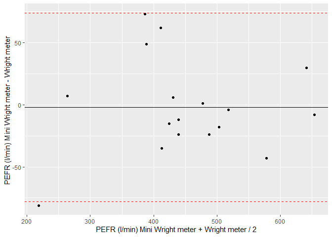

# Task 4: Report

## 1. Table of the mean and difference of per subject measurements made by the Wright and the Mini-Wright

## 2. Bland and Altman plot

``` r
plot = ggplot(ba, aes(x = average, y = difference)) +
  geom_point() +
  geom_hline(yintercept = mean_difference) +
  geom_hline(yintercept = lower, color = "red", linetype="dashed") +
  geom_hline(yintercept = upper, color = "red", linetype="dashed") +
  ylab("PEFR (l/min) Mini Wright meter - Wright meter ") +
  xlab("PEFR (l/min) Mini Wright meter + Wright meter / 2")

plot 
```

<!-- -->

## 3. Discussion of the findings with regard to the agreement between the Wright and Mini-Wright tools.
