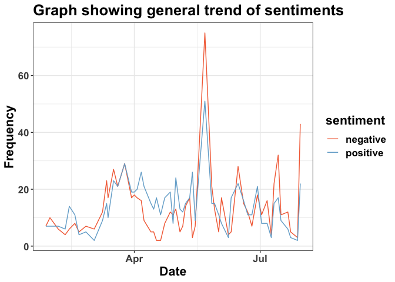

## Exercise 4: Performing text mining and topic modelling

### What is the general trend of sentiments expressed in the various resolutions over time?

``` r
## summarize sentiments by date
iatf_sentiment <- tidy_iatf_data1 %>%
  inner_join(get_sentiments("bing")) %>% #get sentiments
  count(date, sentiment) #group by date and count sentiments
#> Joining with `by = join_by(word)`

## plot general trend of sentiments over time
sentiment_trend <- ggplot(iatf_sentiment, aes(x=date, y=n, color=sentiment))+
  geom_line(stat = "identity")+
  theme_bw()+
  labs( y="Frequency", title="Graph showing general trend of sentiments", x="Date", fill="Sentiment")+
  scale_color_manual(values = c("#f46d43","#74add1"))+
  theme(text=element_text(size=16, face = "bold"))
sentiment_trend
```

<!-- -->

### What are the most common words (by sentiment) used in the various resolutions?

### What general themes can be elicited from the various resolutions in the dataset?
